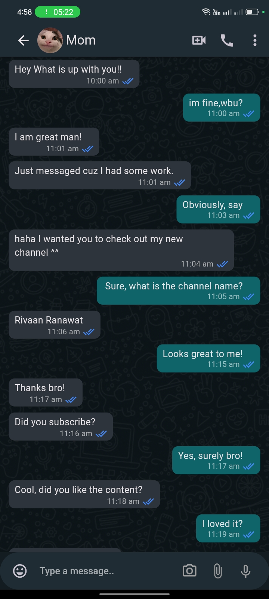

# This is an app based on whatsapp(Only design)

## It's also responsive for web screen

### Here I used
<li>Getx</li>
<li>If screen doesn't exist in website, than button will appear to redirect in web screen</li>

<h3>Home Screen</h3>

<h3>Chat Screen 1</h3>

<h3>Chat Screen 2</h3>

<h3>Web Screen 1</h3>

<h3>Web Screen 2</h3>
